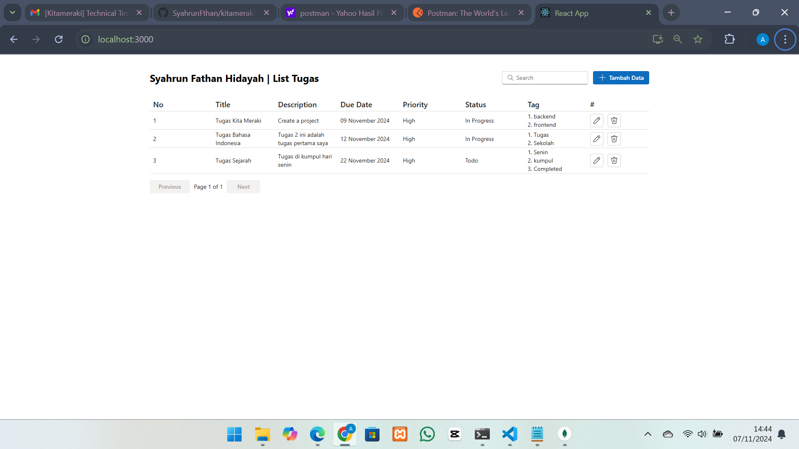
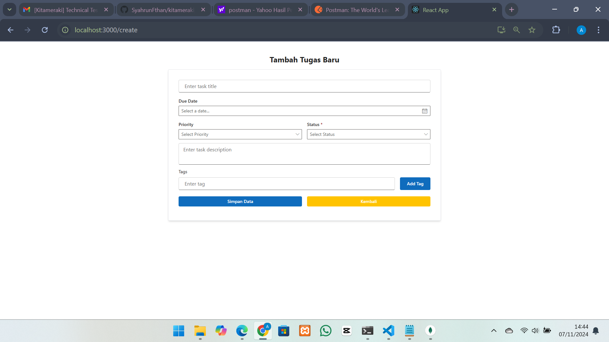
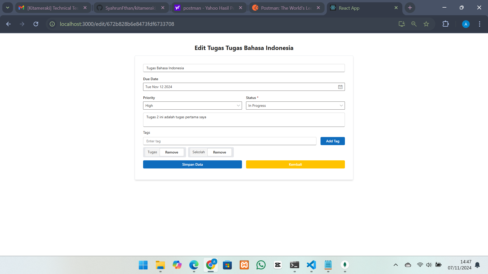

# kitameraki_recruitmen_SyahrunFthan

Project tes pemrograman

## Daftar Isi

- [kitameraki_recruitmen_SyahrunFthan](#kitameraki_recruitmen_syahrunfthan)
  - [Daftar Isi](#daftar-isi)
  - [Persyaratan](#persyaratan)
  - [Instalasi](#instalasi)
    - [Backend](#backend)
    - [Frontend](#frontend)
  - [Penggunaan](#penggunaan)
    - [Backend](#backend-1)
  - [Dokumentasi](#dokumentasi)

## Persyaratan

Sebelum memulai, pastikan Anda memiliki perangkat lunak berikut terinstal di sistem Anda:

- [Node.JS](https://nodejs.org/)
- [MongoDB](https://www.mongodb.com/)

## Instalasi

Cloning repository ini dan menjalankan perintah berikut di terminal Anda:

```bash
git clone https://github.com/SyahrunFthan/kitameraki_recruitment_SyahrunFthan.git


```

### Backend

1. Navigasi ke direktori backend:

```bash
cd backend
```

2. Install dependensi

```bash
npm install
```

3. Konfigurasi file .env:
   ```bash
   MONGODB_URL= // Isi dengan  URL MongoDB Anda
   PORT_APP=5001
   ACCESS_TOKEN=mp4QFM9FijSRP8zGFebHHvFazIEhiQtj8Bvz009lWO0OqoCdfiw7wT1Y6SO47xjo
   ```
4. Jalankan server backend:
   ```bash
   npm start
   ```

Anda dapat mengakses API di [http://localhost:5001](http://localhost:5001)

### Frontend

1. Navigasi ke direktori frontend:

   ```bash
   cd frontend
   ```

2. Instalasi dependensi:
   ```bash
   npm install
   ```
3. Jalankan aplikasi frontend:
   ```bash
   npm start
   ```

Anda dapat mengakses aplikasi di [http://localhost:3000](http://localhost:3000)

## Penggunaan

### Backend

1. Setelah server berjalan, anda dapat mengakses api di [http://localhost:5001/](http://localhost:5001)
2. Gunakan alat seperti [Postman](https://www.postman.com/) untuk mengirim request ke API.
3. Import file openapi.json untuk menguji API.

## Dokumentasi




